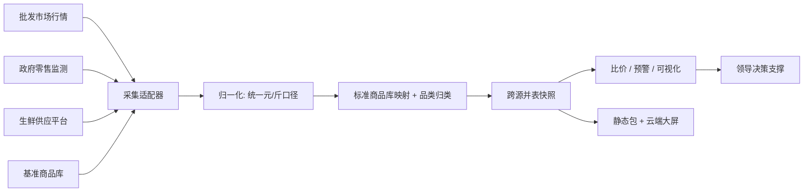

# 智慧食材价格监督平台

### 功能介绍与试点成效汇报
#### —— 以天津市多源价格汇聚试点为例

> **汇报对象**：消防部门领导
> **汇报定位**：后勤给养保障 · 食材成本监督 · 应急物资价格监测
> **编制日期**：2026 年 9 月
> **文档密级**：内部参阅

---

## 文档概要

| 项目 | 内容 |
| --- | --- |
| 平台名称 | 智慧食材价格监督平台 |
| 核心能力 | 多源价格自动汇聚 · 跨市场实时比价 · 异常波动预警 · 可视化监测 |
| 试点城市 | 天津市（已落地） |
| 试点规模 | 8 个数据源 · 118 个标准品类 · 348 条实时报价 |
| 已接入城市 | 厦门 / 北京 / 天津（共 17 个数据源，可横向扩展） |
| 部署形态 | 云端静态化 + 全球加速，一键分享、即点即看 |

---

## 目录

1. [建设背景与战略意义](#一建设背景与战略意义)
2. [平台总体定位与目标](#二平台总体定位与目标)
3. [总体架构：多源汇聚 + 标准治理](#三总体架构多源汇聚--标准治理)
4. [核心能力模块](#四核心能力模块)
5. [天津市试点成效（真实数据）](#五天津市试点成效真实数据)
6. [数据治理与质量保障](#六数据治理与质量保障)
7. [对消防部门的应用价值](#七对消防部门的应用价值)
8. [推广路线与展望](#八推广路线与展望)
9. [附录：关键技术指标](#附录关键技术指标)

---

## 一、建设背景与战略意义

### 1.1 政策与保障导向

食材价格是后勤保障成本的"晴雨表"。无论是**常态化食堂给养**，还是**应急救援状态下的物资保供**，都需要一套权威、实时、可追溯的价格监督手段，做到：

- **成本可控**：掌握全市批发与零售真实行情，杜绝采购价格虚高；
- **波动可察**：对异常涨价、跨市场畸高价差第一时间预警；
- **决策有据**：用数据支撑招标定价、应急采购与预算编制。

### 1.2 传统模式的痛点

| 痛点 | 具体表现 | 本平台解法 |
| --- | --- | --- |
| 信息分散 | 价格散落在多个市场、多个政府网站，靠人工抄录 | 多源自动汇聚，一次采集、全域可用 |
| 口径不一 | 批发/零售、元/公斤/元/斤混杂，难以横向比价 | 统一归一为标准"元/斤"口径，双单位留存 |
| 比价困难 | 同一食材在 6 个市场价差巨大，肉眼难发现 | 跨市场实时比价 + 价差幅度自动计算 |
| 追溯缺失 | 价格变动无历史留痕，无法复盘 | 按日快照、append-only 留痕，全程可回溯 |
| 共享低效 | 报表靠 Excel 邮件往返，领导看不到实时大屏 | 云端可视化大屏，链接即看、可导出 |

### 1.3 消防部门适用场景

- **支队 / 中队食堂给养成本监督**：对米面粮油、肉禽蛋奶、时令蔬果建立价格基准线，采购价偏离即提示。
- **应急保障物资价格监测**：灾备、演练、临时驻勤期间的食材与保障物资价格波动跟踪。
- **跨区域比价与统筹**：多支队分布在不同城区，用全市行情指导就近、择优采购。

---

## 二、平台总体定位与目标

> **一句话定位**：把分散在各个市场、各个政府网站的真实价格，汇聚成一张"全市一张图"，让食材成本监督从"凭经验"走向"看数据"。

| 维度 | 目标 |
| --- | --- |
| 数据广度 | 覆盖批发农贸市场 + 政府零售监测双通道 |
| 更新频率 | 市场报价日更、政府监测月报自动并入 |
| 比对能力 | 同城跨市场、批发 vs 零售、跨城市横向对比 |
| 触达方式 | 领导看板（可视化大屏）+ 业务报表（Excel 导出） |
| 扩展能力 | 一套引擎，换城市即接入，已验证三城可复制 |

---

## 三、总体架构：多源汇聚 + 标准治理

平台采用**"采集层—治理层—服务层"**分层架构，对异构数据源做统一汇聚与标准化，向上提供比价、预警与可视化能力。

### 3.1 架构示意

```text
┌─────────────────────────────────────────────────────────────────────┐
│                          领导可视化层 (Web 大屏)                        │
│   价格地图 · 跨市场比价 · 价差预警 · 品类走势 · 一键导出 Excel          │
└───────────────────────────────────┬─────────────────────────────────┘
                                     │
┌───────────────────────────────────┴─────────────────────────────────┐
│                          数据服务层 (静态化 + 全球加速)                  │
│   标准快照 JSON · localStorage 缓存 · Cloudflare 边缘分发 · 链接即看   │
└───────────────────────────────────┬─────────────────────────────────┘
                                     │
┌───────────────────────────────────┴─────────────────────────────────┐
│                          标准治理层 (核心引擎)                          │
│   统一口径(元/斤) · 标准商品库映射 · 品类自动归类 · 跨源并表 · 异常识别 │
└───────────────────────────────────┬─────────────────────────────────┘
                                     │
┌───────────────────────────────────┴─────────────────────────────────┐
│                          多源采集层 (适配器矩阵)                        │
│  批发市场(21food) │ 政府零售监测(发改委) │ 生鲜平台 │ 本地基准库       │
│  有头浏览器对抗反爬 · 人工校验兜底 · 失败自动沿用历史、累加补齐          │
└─────────────────────────────────────────────────────────────────────┘
```

### 3.2 数据流转



---

## 四、核心能力模块

### 4.1 多源异构数据自动汇聚

平台内置**适配器矩阵**，对接不同性质的源头：

- 批发农贸市场行情（通过合规采集引擎，含反爬对抗与人工校验兜底）；
- 政府权威零售价格监测（发改委公开发布数据，自动抓取最新月报）；
- 生鲜供应平台与本地基准商品库。

> 天津试点已接入 **8 个数据源**：6 大批发农贸市场 + 2 个政府零售监测渠道，覆盖全市主要供给面。

### 4.2 统一口径与标准商品库

不同源头"元/公斤""元/斤"混杂、命名各异。平台通过：

- **单位归一**：全部折算为标准"元/斤"口径，同时保留元/公斤原值；
- **标准商品库映射**：同名/同义商品（如"番茄=西红柿"）自动归并为同一标准品类；
- **品类自动归类**：蔬菜 / 肉禽蛋奶 / 粮油 / 水果 四大类自动打标。

### 4.3 跨市场、跨渠道实时比价

对同一食材，自动计算**全市最低价、最高价、均价与价差幅度**，让"哪个市场更便宜""价差是否异常"一目了然。

> 天津试点 118 个标准品类中，多数品类同时出现在 4–8 个市场，具备充分比价样本。

### 4.4 异常价差与波动预警

- **跨市场畸高价差识别**：同一食材在不同市场报价偏离均值过大时标记；
- **批发→零售加价洞察**：揭示流通环节加价水平，为保供稳价提供抓手；
- **时序波动跟踪**：按日快照留痕，价格突变可回溯、可复盘。

### 4.5 可视化监测大屏

为领导与业务人员提供：价格地图、品类比价榜、价差预警清单、重点品类走势，支持按城市、品类、市场多维筛选。

### 4.6 数据导出与共享

所有表格支持**一键导出 Excel**（含 BOM 防乱码、自动转义），报表可离线存档、上报、会商，无缝对接既有办公流程。

### 4.7 静态化与全域可达

前端采用**静态化 + 边缘加速**部署：数据打包为静态资源，经全球 CDN 分发，生成一条链接即可在任意终端查看，无需安装、无需运维后端服务，安全且易推广。

### 4.8 多城市横向扩展

同一套引擎已验证可复制：**厦门（3 源）、北京（6 源）、天津（8 源）** 三城共用，新增城市仅需配置数据源，平台能力即平移。

---

## 五、天津市试点成效（真实数据）

> 以下数据均来自天津市试点真实汇聚结果（批发报价日期 2026-08-25，零售监测为 2026 年 7 月月均价）。

### 5.1 数据底座规模

| 指标 | 数值 |
| --- | --- |
| 接入数据源 | 8 个 |
| 标准食材品类 | 118 个 |
| 实时报价条数 | 348 条 |
| 覆盖大类 | 蔬菜 / 肉禽蛋奶 / 粮油 / 水果 |
| 批发农贸市场 | 6 个 |
| 政府零售监测渠道 | 2 个 |

### 5.2 数据源清单

| 编号 | 数据源 | 类型 | 口径 |
| --- | --- | --- | --- |
| T1 | 天津武清大沙河 | 批发农贸市场 | 元/斤（日报价） |
| T2 | 天津何庄子 | 批发农贸市场 | 元/斤（日报价） |
| T3 | 天津碧城 | 批发农贸市场 | 元/斤（日报价） |
| T4 | 天津韩家墅海吉星 | 批发农贸市场 | 元/斤（日报价） |
| T5 | 天津红旗农贸 | 批发农贸市场 | 元/斤（日报价） |
| T6 | 天津金钟河 | 批发农贸市场 | 元/斤（日报价） |
| T7 | 天津市发改委（零售监测） | 政府监测 | 元/斤（月均价） |
| T8 | 天津滨海新区（零售监测） | 政府监测 | 元/斤（月均价） |

### 5.3 重点品类全市批发比价（T1–T6，元/斤）

| 品类 | 全市最低 | 全市最高 | 均价 | 价差幅度 |
| --- | --- | --- | --- | --- |
| 大白菜 | 0.50 | 0.85 | 0.68 | 70% |
| 洋白菜 | 0.65 | 1.00 | 0.79 | 54% |
| 韭菜 | 1.25 | 2.00 | 1.56 | 60% |
| 胡萝卜 | 0.70 | 1.35 | 0.98 | 93% |
| 土豆 | 0.85 | 1.40 | 1.04 | 65% |
| 大葱 | 1.15 | 1.65 | 1.36 | 43% |
| 生姜 | 3.50 | 5.50 | 4.41 | 57% |
| 大蒜 | 3.00 | 5.00 | 3.79 | 67% |
| 芹菜 | 0.65 | 1.75 | 1.20 | 169% |
| 菜花 | 1.15 | 1.50 | 1.35 | 30% |
| 西红柿 | 1.20 | 1.90 | 1.48 | 58% |
| 青椒 | 1.25 | 2.50 | 2.02 | 100% |
| 黄瓜 | 1.60 | 3.00 | 2.40 | 88% |
| 冬瓜 | 0.50 | 1.35 | 0.83 | 170% |
| 豆角 | 2.50 | 5.00 | 3.70 | 100% |
| 猪肉(白条猪) | 7.15 | 8.30 | 7.95 | 16% |

> **解读**：同城不同市场同种食材价差普遍在 40%–170% 之间。平台的价值正在于把这种"看不见的价差"显性化，为就近择优采购、核价审价提供直接依据。

### 5.4 批发 vs 零售监测：流通加价洞察

将政府零售监测（T7/T8）与批发均价对照，可直观看到从"产地批发"到"市民零售"的加价水平：

| 品类 | 批发均价 | 零售监测(发改委) | 零售监测(滨海) | 加价幅度 |
| --- | --- | --- | --- | --- |
| 大白菜 | 0.68 | 1.17 | — | +72% |
| 生姜 | 4.41 | 6.20 | 6.45 | +41%~46% |
| 大蒜 | 3.79 | 5.73 | 6.20 | +51%~64% |
| 西红柿 | 1.48 | 2.32 | 2.64 | +57%~78% |
| 黄瓜 | 2.40 | 2.66 | 2.98 | +11%~24% |

> **解读**：平台可同时呈现"批发行情"与"政府权威零售监测"两套视角，既服务采购端核价，也支撑保障端对民生价格的研判。

---

## 六、数据治理与质量保障

| 机制 | 说明 |
| --- | --- |
| 口径归一 | 全部折算元/斤，双单位留存，杜绝单位混淆 |
| 同名归并 | 同义商品自动映射标准库，避免重复计数 |
| 失败兜底 | 单源抓取异常时自动沿用历史数据，累加补齐，不丢市场 |
| 按日留痕 | 快照 append-only 存储，价格变动全程可回溯 |
| 人工校验 | 关键采集环节保留人工核验通道，确保合规与准确 |
| 静态分发 | 前端只读静态包，无后端写入口，安全可控 |

---

## 七、对消防部门的应用价值

| 价值维度 | 具体收益 |
| --- | --- |
| **成本压降** | 用全市真实行情核价，抑制采购虚高，单位给养成本可量化优化 |
| **风险预警** | 异常价差、突发涨价自动标记，保障预算不被"价格突袭" |
| **决策支撑** | 领导看板一图掌握全市行情，汇报、会商有数可依 |
| **审计追溯** | 价格按日留痕，采购合规、专项审计可随时复盘 |
| **快速复制** | 已验证三城可复制，各支队/中队所在地可分批接入 |
| **低门槛推广** | 链接即看、可导出，无需部署复杂系统，便于横向铺开 |

---

## 八、推广路线与展望

| 阶段 | 目标 | 关键动作 |
| --- | --- | --- |
| 试点期（已完成） | 验证天津单城多源汇聚 | 8 源接入、118 品类、可视化大屏上线 |
| 扩面期 | 消防系统重点城市接入 | 复用引擎，按城市配置数据源，批量上线 |
| 深化期 | 预警与统筹能力增强 | 价差阈值预警、跨区域统筹采购建议 |
| 常态期 | 纳入后勤保障例行监督 | 定期报表自动生成、对接既有采购流程 |

**远景**：从"食材价格监督"延伸至"应急保障物资价格全景监测"，构建覆盖平时的后勤给养、战时的应急保供的一体化价格监督体系。

---

## 附录：关键技术指标

| 指标 | 数值 / 说明 |
| --- | --- |
| 已接入城市 | 3 个（厦门、北京、天津） |
| 已接入数据源 | 17 个 |
| 单城最大数据源 | 天津 8 个 |
| 标准品类覆盖 | 100+（天津 118 个） |
| 价格口径 | 元/斤（标准） / 元/公斤（原值留存） |
| 大类覆盖 | 蔬菜、肉禽蛋奶、粮油、水果 |
| 更新机制 | 市场日更 + 政府月报自动并入 |
| 部署方式 | 静态化 + 全球边缘加速，链接即看 |
| 导出能力 | 全表一键导出 Excel（BOM 防乱码） |
| 扩展方式 | 新增城市仅配置数据源，能力即平移 |

---

*本文档数据均基于天津市试点真实汇聚结果编制，可作为向领导汇报的功能介绍与成效佐证材料。*
